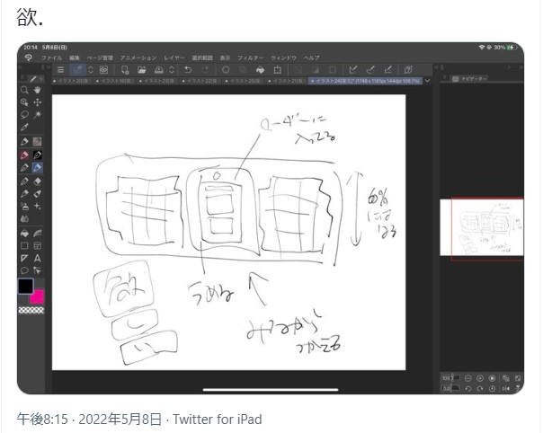
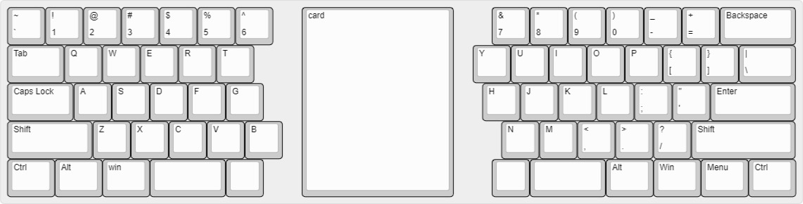
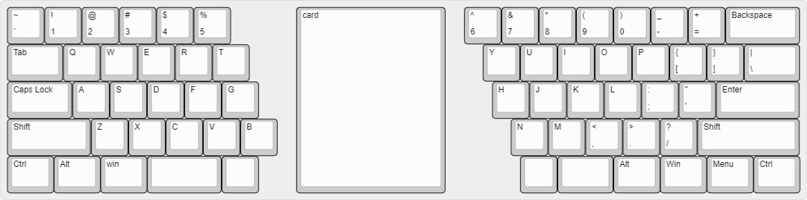
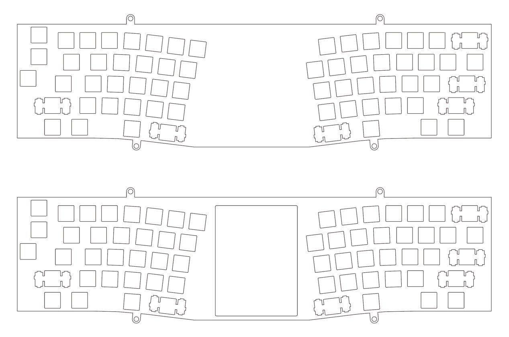

# オタクが幸せになるための道具を作る手段としての自作キーボード
この記事はキーボード #2 Advent Calendar 2022の5日目の記事です。昨日はtakashicompanyさんのXXXでした。

今日はオタク(not KEEB OTAKU)キーボードの話に人間を付き合わせようとしています。キモ＝オタクになりすぎないように気をつけます。

## 目次
[[toc]]

## 自己紹介
はじめまして。nrと申します。読みから決めた名前じゃないので読みはなんでもいいですが、人っぽくするならナリかニレだと思います。こんな感じの題で記事を書きますが、分割キーボードを探すところから自キ入門しました。以降自キエンジョイ勢をやってます。2年生です。

音ゲーでも文字入力でも同時押しが好きじゃない（これは本当に性格の問題）のと、ファンクションキーをよく使うので大きめのキーボードを選びがちですが、別に数字列はどっちでもいい派なのでREVIUNG53はかなり好みでした。それはそれとしてcocot46plusは一種のEGだった。

<blockquote class="twitter-tweet">
REVIUNG53をな… <a href="https://t.co/MaSVk3g5Sf">pic.twitter.com/MaSVk3g5Sf</a>
&mdash; 𝕟𝕣 (@nrt__chan) <a href="https://twitter.com/nrt__chan/status/1578819482193362945?ref_src=twsrc%5Etfw">October 8, 2022</a></blockquote> 

<blockquote class="twitter-tweet">
✌️ <a href="https://twitter.com/hashtag/cocot46plus?src=hash&amp;ref_src=twsrc%5Etfw">#cocot46plus</a> <a href="https://t.co/PRwVpL4wOt">pic.twitter.com/PRwVpL4wOt</a>
&mdash; 𝕟𝕣 (@nrt__chan) <a href="https://twitter.com/nrt__chan/status/1548193671207878656?ref_src=twsrc%5Etfw">July 16, 2022</a></blockquote> 

こんな感じで時折ツイートを引用しますが、私のTwitterはアニメ遊戯王シリーズのキショオタクが7、自作キーボードかじり小僧が1.5、他1.5ぐらいの配分なので見ないほうが良いと思います。というか、**bioが非公式男男観点トークから始まるアカウントは普通は見ない方がいい**。（たまに埋め込まずにスクショを貼っているときは鍵垢に進捗を壁打ちしてたのを拾ってきているものです。どれも自分のツイートです）

個体判別のしやすさだとmeishi2展フリー部門にこれを出してた人というのが一番だと思います。実はゆる部にもお邪魔したことがあります。その節は大変お世話になりました。

<blockquote class="twitter-tweet">
お前をよ 置かせてもらってきましたがよ…(照れますね…) <a href="https://t.co/sx5tp6BMiP">pic.twitter.com/sx5tp6BMiP</a>
&mdash; 𝕟𝕣 (@nrt__chan) <a href="https://twitter.com/nrt__chan/status/1571025391141388289?ref_src=twsrc%5Etfw">September 17, 2022</a></blockquote> 

場違い感からずっとソワソワしてた気持ちと、「いや～私の超かわいいな」って気持ちの両方がありましたね。超かわいくないですか？　かわいいですよね～！　わかります！　私が一番これのことかわいいと思ってます。かわいいって言ってほしいのでかわいいって言ってもらえて嬉しかったです。ありがとうございました。

てか、スイッチプレート2mmと基板の間の3mmを使って嵌め込みパズルみたいなことする（伝われ）のめっちゃかわいい気がするのでもっと作例を見た～い！です。キャスト板でやることかは知らんですけど……。

## 今回の主役
こいつです。たった一枚のカードを大事にしまっておくためのプラスチックのケースとキーボードを融合しました。
<blockquote class="twitter-tweet">
ニャーン <a href="https://t.co/Jt2nks6f4B">pic.twitter.com/Jt2nks6f4B</a>
&mdash; 𝕟𝕣 (@nrt__chan) <a href="https://twitter.com/nrt__chan/status/1582431952459923457?ref_src=twsrc%5Etfw">October 18, 2022</a></blockquote> 

もっと具体的に紹介すると、**TCGフルプロテクトスリーブ・レギュラーサイズを中に入れられるキーボード**を作りました。オタク～！

<blockquote class="embedly-card"><h4><a href="https://www.with-d.co.jp/collections/quick_shipping/products/trading-card-display-64">【即出し可能】TCGフルプロテクトスリーブ・レギュラーサイズ（3個入）</a></h4>
トレーディングカードディスプレイ等を国内で製造・販売しております。特別なカードは特別なディスプレイで飾るべきだという考えのもと、相応しい商品を制作しました。オンライン上でお客様のカード画像を用いてディスプレイイメージをご確認頂けます。
</blockquote>

作っている当時はキーボードをしばくカードオタク全員に必要なものだから頒布したいなと思っていましたが、金も腕もないので見送ってます。基板(JLCPCB産)とネジがちょっと余っているので興味のあるオタクはお声がけください。

## 発端

オタクなので分割キーボードの隙間にカードを置いて使っていました。
そういう日々を送り、そしてオタクは一つ大きな気づきを得ます。

**キーボードにフェイバリットカードが入ってたら幸せなのでは……？！？！？！**

マイフェイバリットカードはそばにあればあるほど嬉しいのだから、毎日長時間しばくアイテムと合体していたらそれはもう絶対に「良い」のでは？　そんな当たり前のことに今更気が付きました。（あと多分「もう中にカード入れちまえよ！」とも思ってましたね……それはそうだろ……）

## 考える
オタクが幸せになれそうな工作を思いついたので手を動かしていきます。KONAMIくんやブシロードくんがカードを入れる場所があるキーボードを出してくれるなら作らなくていいんですが、まあ絶対出ないと思うので自分でやるしかありません。てか作っちゃったけど今からでも出してほしい。出してください。待ってます。

このときはまだフルプロテクトスリーブではなく、マグネットローダーを採用しようとしています。普通に巨大なのでやめました。73×110の長方形の穴、大きくないか？　あと薄くても厚みが5mmあるのも大変そうなのでパス。（参考：フルプロテクトスリーブは71×96×3。縦が15mm近く短い。この差はキーボードだと結構大きい気がします）

メモ書きのスクショをTwitterに投げるみたいなことしてるとあとで引っ張り出したいときに困りますね。

### 先人探し
流石に絶対先人がいるので探しました。この世にはカードオタクもたくさんいれば、オタクカードもたくさんあるので、オタクカード飾りキーボードも存在するに決まっています。n番煎じの確信を持ってredditとdiscordを探し回ったところ、近いこと考えいそうなキーボードが少し見つかりました。

- Pikachuu40
<iframe id="reddit-embed" src="https://www.redditmedia.com/r/LOONA/comments/on7sz2/i_saw_so_many_artworks_but_i_cant_even_draw_so/?ref_source=embed&amp;ref=share&amp;embed=true" sandbox="allow-scripts allow-same-origin allow-popups" style="border: none;" height="348" width="640" scrolling="no"></iframe>

- Jihoney65
<iframe id="reddit-embed" src="https://www.redditmedia.com/r/Fromis/comments/qcnmuy/jihoney65_my_custom_keyboard_with_a_slot_for_a/?ref_source=embed&amp;ref=share&amp;embed=true" sandbox="allow-scripts allow-same-origin allow-popups" style="border: none;" height="342" width="640" scrolling="no"></iframe>

最高！　Jihoney65は売ってたら買ってたかも。

ブロマイド（であってるのかな）入れてるオタクわかりすぎになったんですが（キャラクターのカード（例：FEサイファ）はブロマイドみたいなものなので）、ローダーことプラスチック塊を中に仕込んだ作例は見つかりませんでした。そんなわけないと思うのでご存知の方は教えていただきたいです。

### 形
以下の3つの理由からアクリル積層で作成することは速攻で決まりました。
1. カードがしっかり落ち着ける場所が必要
2. 3Dのことを知らなさ過ぎる（逆にアクリル積層は組み上げた実績があります）
3. アクリル積層が好き

アクリルを積むということは上から見た姿と横から見た姿（断面図）を考える必要があるということです。

プラスチックの立体を中に入れるので交差のことを多少は気にする必要があるでしょうし、中央にしっかりと穴をあけるのでアクリルが折れないようにも考えなければなりません。（実際に、73×110の穴を開けたスイッチプレートを試しに頼んだところ、折れた状態で届いた、みたいなことがありました（いらんとは思いますが、一応補足しておくと舎ではないです。別にいいや8面倒臭い2で特に問い合わせもしてないですし、これはこれで折れることがわかったので良かったと思っています）。これはフルプロテクトスリーブへの転換の理由の一つです）

### 外形とか配列とか（上から）
まずは上からです。規模→配列→外形の順番で考えていきます。

#### 規模
レーザーカットを遊舎工房に頼むつもりだったので横幅を440mm以内に納める必要がありました。一見450×300まで行けそうですが、余白を確保してデータを作成する必要があるので、440×290が最大になります。

カードを入れる都合で、縦は10cm近くは必要です。どうせならコスト削減のためにも440×290に2つ収まるようにしたいところです。また、カードに対してキーボードが大きすぎても見た目がイマイチ！かもしれません。ここで規模が60%ぐらいになることが決まりました。

#### 配列
キーの並びを決めていきます。

まず検討したのはrow staggeredです。理由は単純で、ホームポジションなるものがあることを知る前に入力を習得してしまったせいで、手の運びがあまりにもrow staggeredに慣らされすぎているからです（いわゆるロースタガネイティブです）。正規運指（正規運指？）は小指が頑張りすぎに見えるのできちんと習得する気にもなりません。そういうわけですから、怠惰にrow staggeredにしてしまえ！と考えていました。不採用になったのは見た目の問題です。5TGB（もしくは6TGB）で左右に割ると当然ですが斜めのラインが誕生します。それとカードが入る長方形との相性が微妙でした。なんか……こう……不安になるというか……。

適当にKLEで画像を作ってきました。最下段は本当に適当です。

美しさだけで行けばこの場合はortholinearが一番でしょう（並びがシンプル！）。で、問題は当時はortholinerに触ったことがなく（ちょっと触った感じ使えないことはなさそうだったので別にortholinerで作っても良かったと**今は**思います）、踏み切れませんでした。

そこで、次に検討したのはAlice系です。Aliceは持っています（気に入っていて見てほしいので埋め込みます。SwitchCoutureのアクリルケースです）

<blockquote class="twitter-tweet">
<a href="https://t.co/tt2H4NuV6O">pic.twitter.com/tt2H4NuV6O</a>
&mdash; 𝕟𝕣 (@nrt__chan) <a href="https://twitter.com/nrt__chan/status/1513145691090321408?ref_src=twsrc%5Etfw">April 10, 2022</a></blockquote> 

Aliceに対して個人的にちょっと思うこと（①Shiftの行はもう少し左側だと嬉しい②ちょっと窮屈（分割ユーザーだからでは））があったことや、間にカードが挟まることで左部と右部に隙間が生まれるのを加味した結果、「折れ方を少し甘くする」みたいな考えにたどり着きました。

ですが、ここでKLEを使うのが下手すぎてうまく並べられないという**バカみたいな**困りごとに遭遇します。別にIllustratorもfusion360もあるので頑なにKLEでやる必要もないです。人差し指と中指が拾っているキーが多いことや、指を左右に動かす（指を振る？）と円弧を描くことなどの要素を加えて何度か調整をし、今の形に一回落ち着かせました。Zキー以外は思った場所にあるので結構快適です。Zキーはもっと右でいいけどざ行がレアなのと、ctrl+Zは別に押せるから妥協しました。

最終的なカットデータの色をちょっといじりました。シンメトリカルの要素があるのは遊戯王VRAINSの影響です。

### 断面（横から）
当初は5mmのマグネットローダーを予定していたこともあり、かなり難儀しました。PCの前でぐったりとけながらIllustratorで長方形を書き続けていた気がします。

### 基板とファーム
PicoとQMKにしました。ATmega32U4-AU直付けも検討しましたが、「もげそうだから嫌だなあ」と「USB-Cが良いなあ」が「面倒くさい」「高い」に思い切り負けました。いや、でもマジで高くないですか？

## 作る

5Vが出ているらしいので適当にテープLEDだけつけられるように。あとはノリで配線して爆安！JLCPCBへ発注！　発射までの間にファームを書く！　QMKのドキュメントと睨めっこしながらJSONを書き……などをやりました。割愛！

## 頼む
イラレで適当にデータを作り（割愛）発注。fusion360とイラレで同じdxfを違う感じに表示することがあり、svgをメインで触ってた記憶があります。
明らかに大量のアクリルだったので、半額キャンペーンをありがたがりながら発注。

## 使う
若干自分に寄せたので右手はマジであると思った位置にキーが来て楽しいです。
左手はZだけが思った位置にないのでたまに不便です。VRAINSを汲んだのでいいけど……。

## オチ
別に手元そんな見ねえ（終わり）。いっそ使い慣れない感じにして手元をガン見するキーボードにするのもいいかもしれないですね。

## オマケ
あるゲームの会話イベントがなんか凄まじかったので着せ替えました。

## 概念（雰囲気）でキーボードを作る
早速別の物書きツールの話で恐縮ですが、一年半ほど前にカスタマイズ万年筆が話題になっていたのをご存知でしょうか。

<blockquote class="embedly-card"><h4><a href="https://togetter.com/li/1737731">推し概念の万年筆が作れる！組み合わせ20万通り・インク140種類以上でカスタムできる万年筆がすごい「神造形と神アイデア」</a></h4>
アンコーラ 銀座本店で、カスタマイズ万年筆作ってきました！（奥のは一緒に行った子の） どの色も、組み合わせも、めちゃくちゃ可愛いので、何回も並べては戻してを繰り返した笑 すごく悩んで選んだ組み合わせで出来上がった万年筆、愛着が湧く！ 人も多すぎずゆったり見れました〜 楽しかった！ pic.twitter.com/TJ01sNozj0 この続きを読む \ Tgから毎日100名様にお好きなポイントプレゼント / 🎁ツイート＆ペイでポイント100円分をGET
</blockquote>

この世には万年筆だったり鞄だったりネイルだったり、そういった本当は何も関係のないものに勝手にお気に入りの何かを見出したり、見出だせるように組み合わせたりする仕草をするオタクが存在します。なんか嘘みたいな話ですが実在します。

<blockquote class="embedly-card"><h4><a href="https://www.felissimo.co.jp/oshikra/2213/">いつでも推しを愛でていたい！「概念系推しカラー」でオタバレせずに楽しむ方法 ｜ OshiKra-推しと暮らしとそれから私- ｜ フェリシモ</a></h4>
皆さんは推し活をオープンにしていますか？　それとも、クローズドでこっそり推し活タイプでしょうか？ 推しは人生のオアシスのようなもの。推しのグッズを常に持ち歩きたいと考えるのが本音でしょう。でも、そんなグッズが周囲の目にとまれば、オタバレや推しバレの末、悲劇が起きることも......。たとえオープンにしていても、この人だけには内緒にしたいということもありますよね。 ...
</blockquote>

<blockquote class="embedly-card"><h4><a href="https://numan.tokyo/words/8iolB">概念アクセ（がいねんあくせ）</a></h4>
いつも大好きな推しと一緒にいたい時、一緒にいたいけれど、職場や学校ではオタクな正体を隠していたり、もしくは大っぴらに好きなものを口外できない時、もしくは公共の場にアニメやゲームのキャラなどのグッズを持ち込むのはちょっと恥ずかしいかも......？　という時に大活躍するのが概念アクセ。 密かに、そしてオシャレに推しを身につけたい人にはうってつけの新たな推し活スタイル。 ...
</blockquote>

で、別にancoraでオタク万年筆を拵えるように、オタクキーボードを自作することもできるわけです。基板やアクリル板の色を選ぶのはもちろん、形だったり、まあ、キースイッチのフレーバーを連想ゲームの一助にすることもできるわけで、かなりやりやすい部類だと思います。

毎日長時間しばくキーボードにオタクHAPPY要素を盛り込めばオタクは楽しくなれますし、（自我と自我の関係に一家言あるオタクこそお前好みの分割キーボードを作ってみてほしいと思っていますが、それはそれとして）私はこういう行為を「雰囲気でキーボードを作る」と呼んでいます。本当に雰囲気にある程度の重きを置いてキーボードを作ることになるので。

たとえば光と影みたいな二人だから陰陽のあのマークを意識した曲線を取り入れてみるとか、イメージカラーが紫だからTecsee Purple Panda Switchを使ってみるとか、超てんちゃんのオタクだからMMswitchで水色とピンクを組み合わせちゃう、とかそういう感じの行為です。ちょっと変化球なところだと推しが作中で触っていたキーボードと似た配列にするとかもありえますね。

そういうオタク欲望と自分好みの使い勝手を擦り合わせてMYキーボードを作るという道が自作キーボードには存在します（当然節度は守るべきですが）。

たとえば下のツイートのキーボードではギリシャ神話をモチーフに「ポセイドン海」という場所を中心に揉めてた二人なので……という部品選びをしていました。

<blockquote class="twitter-tweet">
<a href="https://t.co/tt2H4NuV6O">pic.twitter.com/tt2H4NuV6O</a>
&mdash; 𝕟𝕣 (@nrt__chan) <a href="https://twitter.com/nrt__chan/status/1513145691090321408?ref_src=twsrc%5Etfw">April 10, 2022</a></blockquote> 

実際のところ、赤軸茶軸青軸……という風にキースイッチのタイプを色で呼び分けるので難儀する可能性も考えられますが、たくさんの種類があるのでなんとかなるような気もします。何はともあれ、少なくとも手が痛くならないぐらいには使い勝手に歩み寄った方がいいです。

**で、今回も雰囲気でキーボードを作っていきます。** こんな感じになります。
- 飾りたいカード：鮫のカード
  - CNo.101 S・H・Dark・Knightの20thシク。お値段は5000円ちょっと。
  - アニメキャラのエースカードの一枚。キャラデッキを組んでいるので私のエースでもある。
- 使うキーキャップ：PBTfans™ Doubleshot/Tripleshot Deep Sea PredatorとPBTFANS BASIN
  - BASINはAdriaticの方。40sが不成立で本当に悲しい。時期の問題だろ。
  - Deep Sea Predatorがあったので鮫のカードを飾ろうかなという気になった、という展開のほうが近いかもしれない。
- スイッチ：Tecsee Purple Panda Switch
  - 完全に色で採用。でもPanda系は結構嫌いじゃないです。結構好きな気がする。
  - SharkSwitchを買うのを後回しにしていたら在庫が全然消えてて笑っちゃった。舎に再入荷したら買います。
- アクリルの色：マットブラックと赤
  - イメージカラーに近いものを拾いつつ、他の好きなカードも飾れそうなところをチョイス
  - 押出があるマットブラックを選んだ……というところもかなりある。
